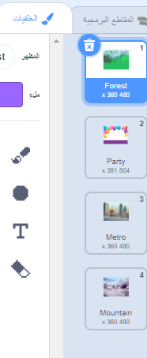

يمكنك استخدام الخلفيات في مشروع سكراتش لإنشاء صفحات أو مستويات مختلفة.

**تغيير البرنامج التعليمي للخلفية**: [انظر في الداخل](https://scratch.mit.edu/projects/498966268/editor){: target = "_ blank"}
<div class="scratch-preview" style="margin-left: 15px;">
  <iframe allowtransparency="true" width="485" height="402" src="https://scratch.mit.edu/projects/embed/498966268/?autostart=false" frameborder="0"></iframe>
</div>

انقر فوق جزء المنصة ثم **الخلفيات** لعرض الخلفيات الخاصة بمشروعك. يمكنك سحب الخلفيات لإعادة ترتيبها.



هناك العديد من الطرق `للانتقال إلى الخلفية`{: class = "block3looks"}. اختر واحدًا يناسب مشروعك.

```blocks3
when [space v] key pressed
next backdrop
```

```blocks3
when stage clicked // click on the Stage
next backdrop
```

```blocks3
when this sprite clicked // click on a sprite
next backdrop
```

```blocks3
when backdrop switches to [page1 v]
wait [5] seconds
next backdrop
```
