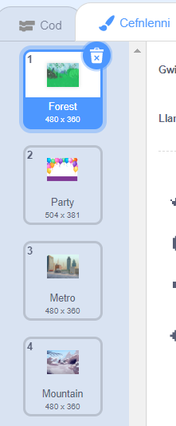

Galli di ddefnyddio ceflenni mewn prosiect Scratch i greu gwahanol dudalennau neu lefelau.

**Tiwtorial newid cefnlenni**: [Gweld tu mewn](https://scratch.mit.edu/projects/624141516/editor){:target="_blank"}
<div class="scratch-preview" style="margin-left: 15px;">
  <iframe allowtransparency="true" width="485" height="402" src="https://scratch.mit.edu/projects/embed/624141516/?autostart=false" frameborder="0"></iframe>
</div>

Clicia ar gwarel y Llwyfan ac yna ar y **Cefnlenni** i weld cefnlenni dy brosiect. Galli di lusgo'r cefnlenni i'w hail-drefnu.



Mae yna lawer o ffyrdd i symud i'r `gefnlen nesaf`{:class="block3looks"}. Dewisa un sy'n gweithio i dy brosiect.

```blocks3
when [space v] key pressed
next backdrop
```

```blocks3
when stage clicked // Clicia ar y Llwyfan
next backdrop
```

```blocks3
when this sprite clicked // Clicia ar gorlun
next backdrop
```

```blocks3
when backdrop switches to [page1 v]
wait [5] seconds
next backdrop
```
