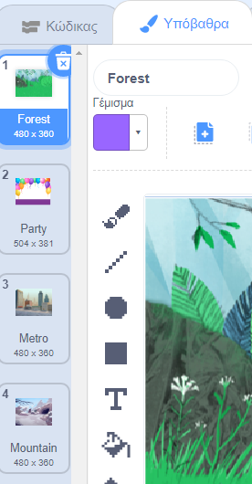

Μπορείς να χρησιμοποιήσεις υπόβαθρα σε ένα έργο Scratch για να δημιουργήσεις διαφορετικές σελίδες ή επίπεδα.
<div class="scratch-preview" style="margin-left: 15px;">
  <iframe allowtransparency="true" width="485" height="402" src="" frameborder="0"></iframe>
</div>

Κάνε κλικ στο παράθυρο Σκηνή και στη συνέχεια στην καρτέλα **Υπόβαθρα** για να δεις τα υπόβαθρα για το έργο σου. Μπορείς να σύρεις τα υπόβαθρα για να τα αναδιατάξεις.



Υπάρχουν πολλοί τρόποι μετάβασης στο `επόμενο υπόβαθρο`{:class="block3looks"}. Επίλεξε ένα που να ταιριάζει στο έργο σου.

```blocks3
when [space v] key pressed
next backdrop
```

```blocks3
when stage clicked // click on the Stage
next backdrop
```

```blocks3
when this sprite clicked // click on a sprite
next backdrop
```

```blocks3
when backdrop switches to [page1 v]
wait [5] seconds
next backdrop
```
