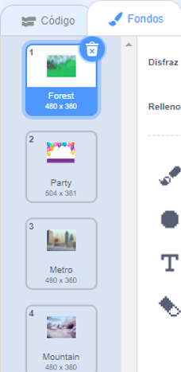

Puedes utilizar fondos en un proyecto Scratch para crear diferentes páginas o niveles.

**Tutorial para cambiar el fondo**: [Ver dentro](https://scratch.mit.edu/projects/594561664/editor){:target="_blank"}
<div class="scratch-preview" style="margin-left: 15px;">
  <iframe allowtransparency="true" width="485" height="402" src="https://scratch.mit.edu/projects/embed/594561664/?autostart=false" frameborder="0"></iframe>
</div>

Haz clic en el panel Escenario y luego en la pestaña **Fondos** para ver los fondos de tu proyecto. Puedes arrastrar los fondos para reordenarlos.



Hay muchas formas de pasar al `siguiente fondo`{:class="block3looks"}. Elige una que funcione para tu proyecto.

```blocks3
when [space v] key pressed
next backdrop
```

```blocks3
when stage clicked // Haz clic en el Escenario
next backdrop
```

```blocks3
when this sprite clicked // Haz clic en un objeto
next backdrop
```

```blocks3
when backdrop switches to [page1 v]
wait [5] seconds
next backdrop
```

