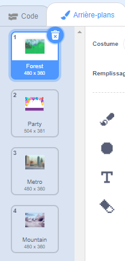

Tu peux utiliser des arrière-plans dans un projet Scratch pour créer différentes pages ou niveaux.

**Tutoriel sur la modification d'arrière-plan** : [Voir à l'intérieur](https://scratch.mit.edu/projects/563147437/editor){:target="_blank"}
<div class="scratch-preview" style="margin-left: 15px;">
  <iframe allowtransparency="true" width="485" height="402" src="https://scratch.mit.edu/projects/embed/563147437/?autostart=false" frameborder="0"></iframe>
</div>

Clique sur le volet Scène, puis sur l' **arrière-plan** pour afficher les arrière-plans de ton projet. Tu peux faire glisser les arrière-plans pour les réorganiser.



Il existe de nombreuses façons de passer à l'`arrière-plan suivant`{:class="block3looks"}. Choisis celui qui convient à ton projet.

```blocks3
when [space v] key pressed
next backdrop
```

```blocks3
when stage clicked // Clique sur la scène
next backdrop
```

```blocks3
when this sprite clicked // Clique sur un sprite
next backdrop
```

```blocks3
when backdrop switches to [page1 v]
wait [5] seconds
next backdrop
```
