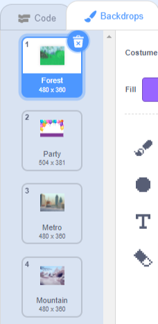

आप अलग-अलग पृष्ठ या स्तर बनाने के लिए स्क्रैच प्रोजेक्ट में बैकड्रॉप का उपयोग कर सकते हैं।
**पृष्ठभूमि ट्यूटोरियल बदले**: [अंदर देखें](https://scratch.mit.edu/projects/883064009/editor){:target="_blank"}
<div class="scratch-preview" style="margin-left: 15px;">
  <iframe allowtransparency="true" width="485" height="402" src="https://scratch.mit.edu/projects/embed/883064009/?autostart=false" frameborder="0"></iframe>
</div>

अपने परियोजना की पृष्ठभूमि देखने के लिए स्टेज पैन पर क्लिक करें और फिर **पृष्ठभूमि** टैब पर क्लिक करें। आप उन्हें पुन: व्यवस्थित करने के लिए पृष्ठभूमि को खींच सकते हैं।



`अगली पृष्ठभूमि`{:class="block3looks"} पर जाने के कई तरीके हैं। अपनी परियोजना के लिए काम करने वाला एक चुनें।

```blocks3
when [space v] key pressed
next backdrop
```

```blocks3
when stage clicked // स्टेज पर क्लिक करें
next backdrop
```

```blocks3
when this sprite clicked // स्प्राइट पर क्लिक करें
next backdrop
```

```blocks3
when backdrop switches to [पृष्ठ 1 v]
wait [5] seconds
next backdrop
```
