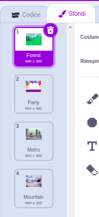

You can use backdrops in a Scratch project to create different pages or levels.
<div class="scratch-preview" style="margin-left: 15px;">
  <iframe allowtransparency="true" width="485" height="402" src="" frameborder="0"></iframe>
</div>

Click on the Stage pane and then the **Backdrops** tab to view the backdrops for your project. You can drag the backdrops to reorder them.



There are lots of ways to move to the `next backdrop`{:class="block3looks"}. Choose one that works for your project.

```blocks3
when [space v] key pressed
next backdrop
```

```blocks3
when stage clicked // click on the Stage
next backdrop
```

```blocks3
when this sprite clicked // click on a sprite
next backdrop
```

```blocks3
when backdrop switches to [page1 v]
wait [5] seconds
next backdrop
```
