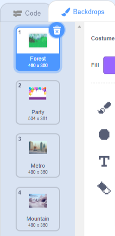

Scratchでは、背景を使ってべつのページやレベルを作ることができます。

**背景の切りかえ方**: [中を見る](https://scratch.mit.edu/projects/563147825/editor){:target="_blank"}
<div class="scratch-preview" style="margin-left: 15px;">
  <iframe allowtransparency="true" width="485" height="402" src="https://scratch.mit.edu/projects/embed/563147825/?autostart=false" frameborder="0"></iframe>
</div>

右の角にある「ステージ」をクリックしてから**背景**タブをクリックすると、プロジェクトに使われている背景を見ることができます。 背景をドラッグするとならべかえることができます。



`次の背景にする`{:class="block3looks"}には、いろいろなやり方があります。 プロジェクトに合ったやりかたをえらんでください。

```blocks3
when [space v] key pressed
next backdrop
```

```blocks3
when stage clicked // ステージをクリックしてください
next backdrop
```

```blocks3
when this sprite clicked // スプライトをクリックしてください
next backdrop
```

```blocks3
when backdrop switches to [page1 v]
wait [5] seconds
next backdrop
```
