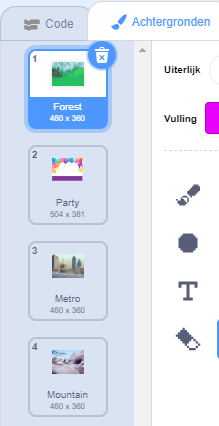

Je kunt achtergronden in een Scratch-project gebruiken om verschillende pagina's of niveaus te maken.

**Leer achtergrond aanpassen**: [Klik hier](https://scratch.mit.edu/projects/563148167/editor){:target="_blank"}
<div class="scratch-preview" style="margin-left: 15px;">
  <iframe allowtransparency="true" width="485" height="402" src="https://scratch.mit.edu/projects/embed/563148167/?autostart=false" frameborder="0"></iframe>
</div>

Klik op het Speelveld en vervolgens op het **Achtergronden** tabblad om de achtergronden voor jouw project te bekijken. Je kunt de achtergronden slepen om ze op een andere plek te zetten.



Er zijn veel manieren om naar de `volgende achtergrond`{:class="block3looks"} te gaan. Kies er een die bij jouw project past.

```blocks3
when [space v] key pressed
next backdrop
```

```blocks3
when stage clicked // Klik op het Speelveld
next backdrop
```

```blocks3
when this sprite clicked // Klik op een sprite
next backdrop
```

```blocks3
when backdrop switches to [page1 v]
wait [5] seconds
next backdrop
```
