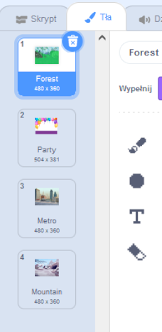

Możesz używać teł w projekcie Scratch, aby tworzyć różne strony lub poziomy.
<div class="scratch-preview" style="margin-left: 15px;">
  <iframe allowtransparency="true" width="485" height="402" src="" frameborder="0"></iframe>
</div>

Kliknij panel Sceny, a następnie **Tła**, aby wyświetlić tła dla swojego projektu. Możesz przeciągać tła, aby zmienić ich kolejność.



Istnieje wiele sposobów na przejście do `następnego tła`{:class="block3looks"}. Wybierz taki, który pasuje do Twojego projektu.

```blocks3
when [space v] key pressed
next backdrop
```

```blocks3
when stage clicked // click on the Stage
next backdrop
```

```blocks3
when this sprite clicked // click on a sprite
next backdrop
```

```blocks3
when backdrop switches to [page1 v]
wait [5] seconds
next backdrop
```
