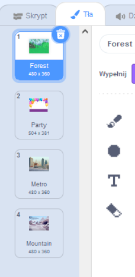

Możesz używać teł w projekcie Scratch, aby tworzyć różne strony lub poziomy.
<div class="scratch-preview" style="margin-left: 15px;">
  <iframe allowtransparency="true" width="485" height="402" src="" frameborder="0"></iframe>
</div>

Kliknij panel Sceny, a następnie **Tła**, aby wyświetlić tła dla swojego projektu. Możesz przeciągać tła, aby zmienić ich kolejność.



Istnieje wiele sposobów na przejście do `następnego tła`{:class="block3looks"}. Wybierz taki, który pasuje do Twojego projektu.

```blocks3
kiedy klawisz [spacja v] naciśnięty
następne tło
```

```blocks3
kiedy scena kliknięta // kliknij na scenę
następne tło
```

```blocks3
kiedy ten duszek kliknięty // kliknij na duszka
następne tło
```

```blocks3
kiedy tło zmieni się na [strona1 v]
czekaj [5] sekund
następne tło
```
