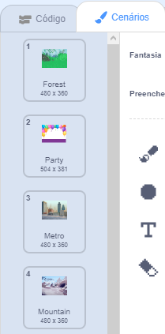

Você pode usar cenários em um projeto Scratch para criar diferentes páginas ou níveis.

**Tutorial de alteração do cenário**: [Veja dentro de](https://scratch.mit.edu/projects/498966268/editor){: target = "_ blank"}
<div class="scratch-preview" style="margin-left: 15px;">
  <iframe allowtransparency="true" width="485" height="402" src="https://scratch.mit.edu/projects/embed/498966268/?autostart=false" frameborder="0"></iframe>
</div>

Clique no painel palco e, em seguida, na aba **Cenários** para visualizar os cenários para o seu projeto. Você pode arrastar os cenários para reordená-los.



Existem várias maneiras de ir para o `próximo cenário`{:class="block3looks"}. Escolha um que funciona em seu projeto.

```blocks3
when [space v] key pressed
next backdrop
```

```blocks3
when stage clicked // click on the Stage
next backdrop
```

```blocks3
when this sprite clicked // click on a sprite
next backdrop
```

```blocks3
when backdrop switches to [page1 v]
wait [5] seconds
next backdrop
```
