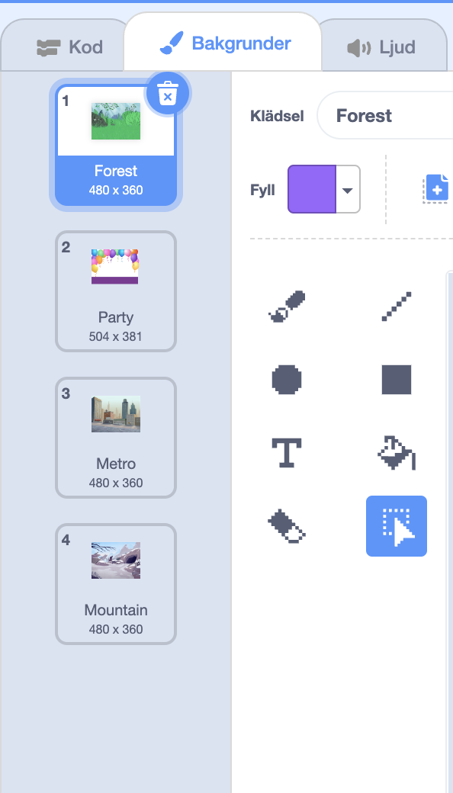

Du kan använda bakgrunder i ett Scratch-projekt för att skapa olika sidor eller nivåer.

**Handledning för att ändra bakgrund**: [Se inuti](https://scratch.mit.edu/projects/827031332/editor){:target="_blank"}
<div class="scratch-preview" style="margin-left: 15px;">
  <iframe allowtransparency="true" width="485" height="402" src="https://scratch.mit.edu/projects/embed/827031332/?autostart=false" frameborder="0"></iframe>
</div>

Klicka på scenpanelen och sedan på fliken **Bakgrunder** för att se bakgrunderna till ditt projekt. Du kan dra i bakgrunderna för att ändra ordning på dem.



Det finns många sätt att flytta till `nästa bakgrund`{:class="block3looks"}. Välj en som fungerar för ditt projekt.

```blocks3
when [space v] key pressed
next backdrop
```

```blocks3
when stage clicked // Klicka på scenen
next backdrop
```

```blocks3
when this sprite clicked // Klicka på en sprajt
next backdrop
```

```blocks3
when backdrop switches to [sida1 v]
wait [5] seconds
next backdrop
```
