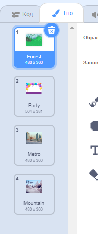

Ти можеш використовувати тло у проєкті Scratch для створення різних сторінок або рівнів.

**Туторіал: зміна тла**: [Переглянути код](https://scratch.mit.edu/projects/751482141/editor){:target="_blank"}
<div class="scratch-preview" style="margin-left: 15px;">
  <iframe allowtransparency="true" width="485" height="402" src="https://scratch.mit.edu/projects/embed/751482141/?autostart=false" frameborder="0"></iframe>
</div>

Натисни на панель «Сцена», а потім на вкладку **Тло**, щоб переглянути тла для твого проєкту. Ти можеш перетягувати тла, щоб змінити їх порядок.



Є багато способів перейти на `наступне тло`{:class="block3looks"}. Вибери той, який підходить для твого проєкту.

```blocks3
when [space v] key pressed
next backdrop
```

```blocks3
when stage clicked // Натисни «Сцена»
next backdrop
```

```blocks3
when this sprite clicked // Натисни на спрайт
next backdrop
```

```blocks3
when backdrop switches to [сторінка1 v]
wait [5] seconds
next backdrop
```
